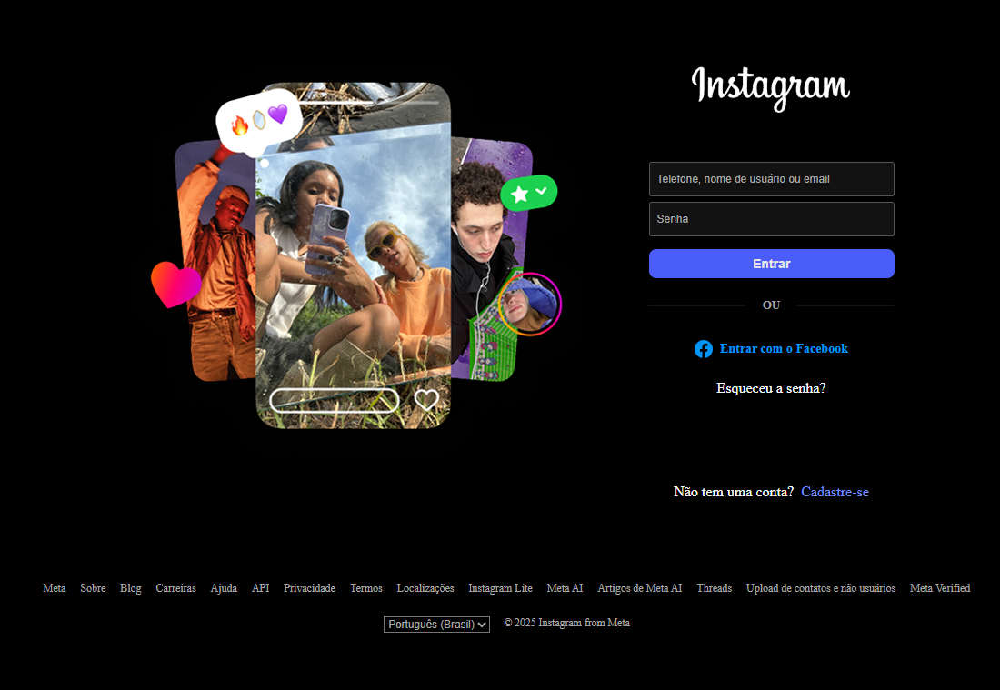
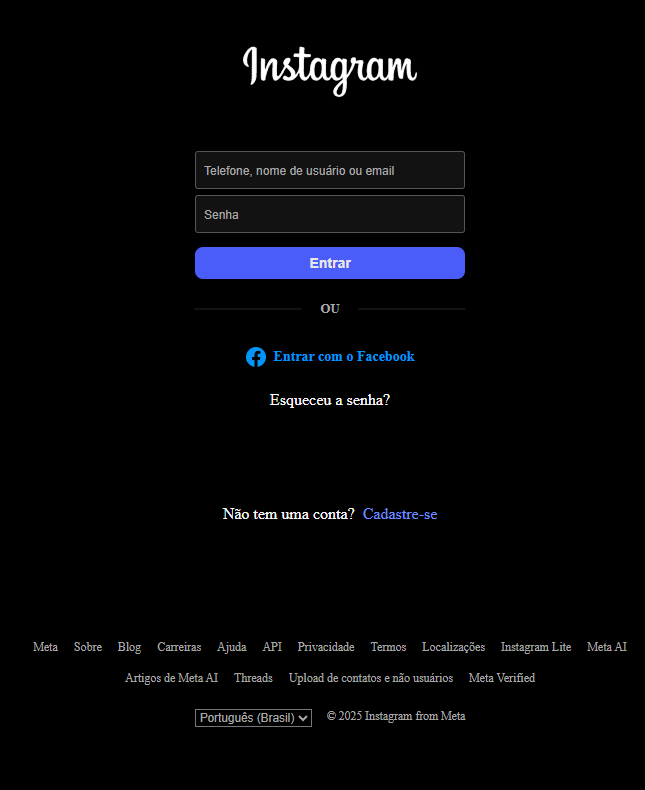

# static-file-server-instagram-login

This project is a complete application, with front-end and back-end.
The back-end functions as a simple distribution server that delivers static files to clients — similar to a hosting service — blocking all HTTP methods other than GET and returning a protective 404 message when a resource is not found.

The back-end was built with Node.js Core modules, without external dependencies.

The front-end is a clone of the Instagram login page, created using HTML and CSS.

---

## ✨ Features

- Static File Server – Sends static HTML, CSS, and image files to the client.

- Request Filtering – Allows only the GET method for security and simplicity.

- Custom 404 Handling – Returns a feedback text when a file is not found.

- Pure Node.js Core Modules – Built only with:

- http → for handling server requests and responses

- fs → for reading files from the filesystem

- path → for managing and normalizing file paths

- Frontend Interface – Instagram login page clone made with pure HTML and CSS.

---

## 🚀 Technologies

This project was developed with the following technologies:

- HTML
- CSS
- JavaScript
- NodeJS

---

## 📷 Screenshots

### Desktop


### mobile


---

## 📦 How to use

1. Clone the repository:
```bash
git clone https://github.com/michaelprocha/static-file-server-instagram-login.git
```

2. Run it through a local server [NodeJS](https://nodejs.org/en/download).

3. How to run: node ./server/server.js

---

## 👨‍💻 Author

Made by [Michael Rocha](https://github.com/michaelprocha)

---

## 📄 License

This project is licensed under the MIT License. See the LICENSE file for more details.